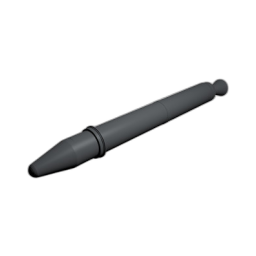
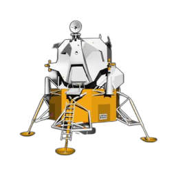

# DreamSat: Towards a General 3D Model for Novel View Synthesis of Space Objects

[Project Page](https://dream-sat.github.io/) | arXiv (coming soon) 

## Project Overview

Novel view synthesis (NVS) enables to generate new images of a scene or convert a set of 2D images into a comprehensive 3D model. In the context of Space Domain Awareness, since space is becoming increasingly congested, NVS can accurately map space objects and debris, improving the safety and efficiency of space operations. Similarly, in Rendezvous and Proximity Operations missions, 3D models can provide details about a target object's shape, size, and orientation, allowing for better planning and prediction of the target's behavior. 

In this work, we explore the generalization abilities of these reconstruction techniques, aiming to avoid the necessity of retraining for each new scene, by presenting a novel approach to 3D spacecraft reconstruction from single-view images, DreamSat, by fine-tuning the Zero123 XL, a state-of-the-art single-view reconstruction model, on a high-quality dataset of 190 high-quality spacecraft models and integrating it into the DreamGaussian framework. 

We demonstrate consistent improvements in reconstruction quality across multiple metrics, including Contrastive Language-Image Pretraining (CLIP) score (+0.33\%), Peak Signal-to-Noise Ratio (PSNR) (+2.53\%), Structural Similarity Index (SSIM) (+2.38\%), and Learned Perceptual Image Patch Similarity (LPIPS) (+0.16\%) on a test set of 30 previously unseen spacecraft images.
Our method addresses the lack of domain-specific 3D reconstruction tools in the space industry by leveraging state-of-the-art diffusion models and 3D Gaussian splatting techniques. This approach maintains the efficiency of the DreamGaussian framework while enhancing the accuracy and detail of spacecraft reconstructions. 

| Spacecraft                  | Input                     | Generated Novel Views         |
|-----------------------------|---------------------------|-------------------------------|
| Explorer 1                  |  |  |
| Apollo Lunar Module         |  |  |
| Space Launch System Block 1 |  |  |

### Dataset

For data, 190 spacecraft 3D models from National Aeronautics and Space Administration (NASA), European Space Agency (ESA), and Synthetic Dataset for Satellites (SPE3R) datasets were used. Using the provided Blender file,  extract camera angles and json file using a data format required by Zero123 (https://github.com/cvlab-columbia/zero123).


### Installation/Dependencies

Copy the data over to the GPU server. Clone the zero123 repository and upload the Zero123XL checkpoint. Make sure to update simple.py file to adjust train/validation split.
Run the finetuning (download missing packages if prompted) and save the finetuned model
python main.py \
    -t \
    --base configs/sd-objaverse-finetune-c_concat-256.yaml \
    --gpus 0,1,2,3,4 \
    --scale_lr False \
    --num_nodes 1 \
    --seed 42 \
    --check_val_every_n_epoch 10 \
    --finetune_from zero123-xl.ckpt


Clone the DreamGaussian repository (https://github.com/dreamgaussian/dreamgaussian). Then, upload  checkpoint and config files and adjust model paths in main.py, main2.py, and any other files needed to use the finetuned model instead of the original Zero123XL

CLIP similarity can be calculated through running python -m kiui.cli.clip_sim example_rgba.png example.obj. The script to calculate LPIPS, PSNR, SSIM is provided in this repository.

<!-- # Resources -->

<!-- ## Papers
- K. Chang and J. Fletcher, “Learned Satellite Radiometry Modeling from Linear Pass Observations,” Sep. 2023.
- J. Luiten, G. Kopanas, B. Leibe, and D. Ramanan, “Dynamic 3D Gaussians: Tracking by Persistent Dynamic View Synthesis.” arXiv, Aug. 18, 2023. doi: 10.48550/arXiv.2308.09713.
- B. Kerbl, G. Kopanas, T. Leimkühler, and G. Drettakis, “3D Gaussian Splatting for Real-Time Radiance Field Rendering.” arXiv, Aug. 08, 2023. doi: 10.48550/arXiv.2308.04079.
- B. Caruso, T. Mahendrakar, V. M. Nguyen, R. T. White, and T. Steffen, “3D Reconstruction of Non-cooperative Resident Space Objects using Instant NGP-accelerated NeRF and D-NeRF.” arXiv, Jun. 09, 2023. doi: 10.48550/arXiv.2301.09060.
- C. Smith, Y. Du, A. Tewari, and V. Sitzmann, “FlowCam: Training Generalizable 3D Radiance Fields without Camera Poses via Pixel-Aligned Scene Flow.” arXiv, May 31, 2023. doi: 10.48550/arXiv.2306.00180.
- Z. Li, Q. Wang, F. Cole, R. Tucker, and N. Snavely, “DynIBaR: Neural Dynamic Image-Based Rendering.” arXiv, Apr. 24, 2023. doi: 10.48550/arXiv.2211.11082.
- E. R. Chan et al., “Generative Novel View Synthesis with 3D-Aware Diffusion Models.” arXiv, Apr. 05, 2023. doi: 10.48550/arXiv.2304.02602.
- A. Mergy, G. Lecuyer, D. Derksen, and D. Izzo, “Vision-based Neural Scene Representations for Spacecraft.” arXiv, May 11, 2021. doi: 10.48550/arXiv.2105.06405.
- J. Lucas, T. Kyono, J. Yang, and J. Fletcher, “Discovering 3-D Structure of LEO Obects,” 2021. -->

## Citing

If you find this project research useful, please cite our work:

```
@inproceedings{dreamsat,
author = {Mathihalli, Nidhi and Wei, Audrey and Lavezzi, Giovanni and Mun Siew, Peng and Rodriguez-Fernandez, Victor and Urrutxua, Hodei and Linares, Richard},
year = {2024},
month = {10},
pages = {},
booktitle = {75rd International Astronautical Congress 2024},
publisher = {International Astronautical Federation},
address = {Milan, Italy},
title = {DreamSat: Towards a General 3D Model for Novel View Synthesis of Space Objects}
}
```

Link to the paper: coming soon ...
<!-- Link to the [paper](https://www.researchgate.net/publication/384042830_Early_Classification_of_Space_Objects_based_on_Astrometric_Time_Series_Data). -->

## Acknowledgments

Research was sponsored by the Department of the Air Force Artificial Intelligence Accelerator and was accomplished under Cooperative Agreement Number FA8750-19-2-1000. The views and conclusions contained in this document are those of the authors and should not be interpreted as representing the official policies, either expressed or implied, of the Department of the Air Force or the U.S. Government. The U.S. Government is authorized to reproduce and distribute reprints for Government purposes notwithstanding any copyright notation herein. 

The authors acknowledge the MIT SuperCloud for providing HPC resources that have contributed to the research results reported within this paper.

H.U. wishes to acknowledge support through the research grant TED2021-132099B-C32 funded by MCIN/AEI/10.13039/501100011033 and the ``European Union NextGenerationEU/PRTR''.

