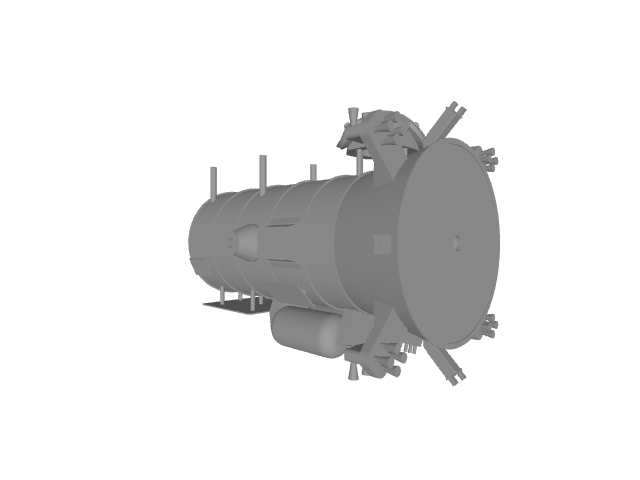
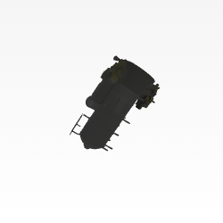
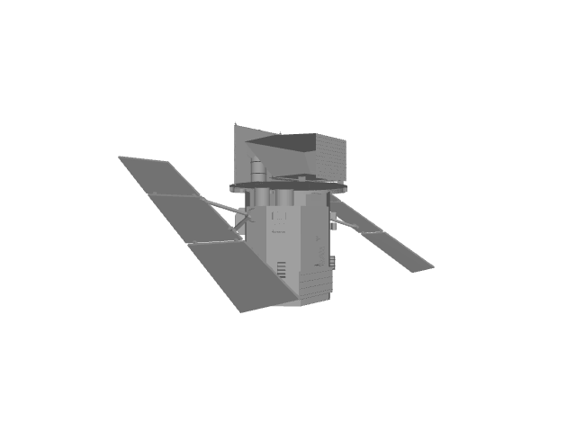
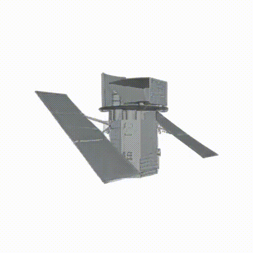
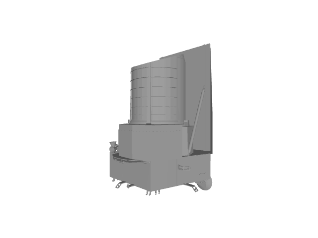
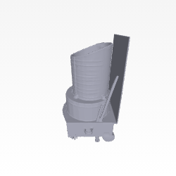
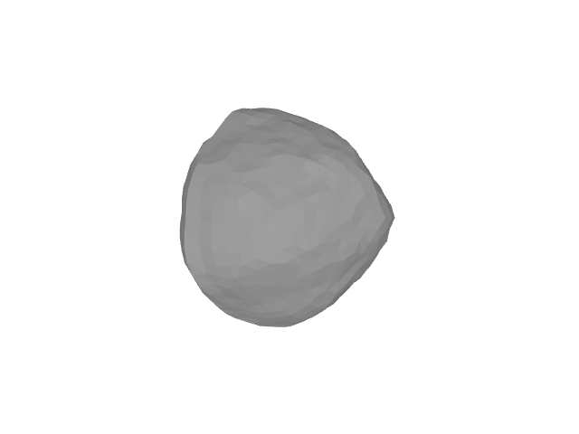
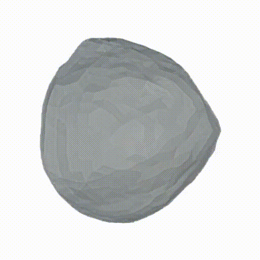
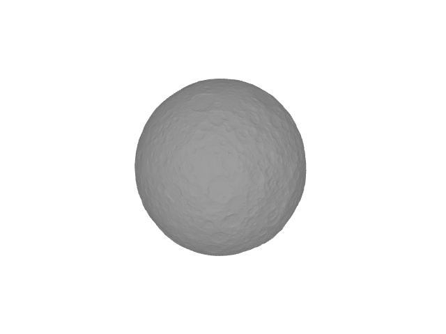
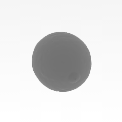

# DreamSat-2.0: Towards a General Single-View Asteroid 3D Reconstruction

[Project Page](https://dreamsat-2-0.github.io/) | [arXiv](https://www.arxiv.org/abs/2508.01079)

## Project Overview

To enhance asteroid exploration and autonomous spacecraft navigation, we introduce DreamSat-2.0, a pipeline that benchmarks three state-of-the-art 3D reconstruction models—Hunyuan-3D, Trellis-3D, and Ouroboros-3D—on custom
spacecraft and asteroid datasets. Our systematic analysis, using 2D perceptual (image quality) and 3D geometric (shape accuracy) metrics, reveals that model performance is domain-dependent. While models produce higher-quality images of complex spacecraft, they achieve better geometric reconstructions for the simpler forms of asteroids. New benchmarks are established, with Hunyuan-3D achieving top perceptual scores on spacecraft but its best geometric accuracy on asteroids, marking a significant advance over our prior work.


| Model                       | Input                     | Generated Novel Views         |
|-----------------------------|---------------------------|-------------------------------|
| Trellis-3D                 |    |    |
| Ouroboros-3D               |   | |
| Hunyuan-3D                 |    |    |
| Ouroboros-3D               |   | |
| Hunyuan-3D                 |    |    |

### Dataset

We evaluate DreamSat-2.0 on two curated 3D model collections: (1) a spacecraft set of 210 high-quality meshes sourced from NASA, ESA, and SPE3R (the latter contributes 64 unique spacecraft), covering satellites, probes, and stations; and (2) an asteroid set assembled from the NASA Planetary Data System (45 high-quality bodies) and the 3D Asteroid Catalogue (1,660 total entries spanning lightcurve-based, radar-based, and imagery-based models). For fair, model-agnostic benchmarking, we generate standardized single-view renders per object with our internal tools (uniform camera distance, background, and resolution), then feed those views to each reconstruction model. To match prior work, we keep the spacecraft split at 190 train / 20 test and the asteroid split at 95 train / 20 test; fine-tuning is applied only to adaptable models (e.g., Trellis-3D), while all models are evaluated on the held-out test sets.


### Installation/Dependencies

Steps on how to run these models are in their respective folders i.e: instructions on how to run ourobros are in the ouroboros folder. Hunyuan 3D-2 can be installed dirrectly from their [repository](https://github.com/Tencent-Hunyuan/Hunyuan3D-2): For metrics, you can use the `all_metrics.py` file under the main project folder. 

## Citing

If you find this project research useful, please cite our work:

```
@inproceedings{dreamsat2,
author = {Diaz, Santiago and Hu, Xinghui and Uwumukiza, Josiane and Lavezzi, Giovanni and 
	Rodriguez-Fernandez, Victor and Linares, Richard},
title = {DreamSat-2.0: Towards A General Single-view Asteroid 3D Reconstruction},
year = {2025},
month = {08},
pages = {},
address = {Boston, MA, USA},
booktitle = {2025 AAS/AIAA Astrodynamics Specialist Conference},
}
```

Link to the paper: [arXiv](https://www.arxiv.org/pdf/2508.01079) | [ResearchGate](https://www.researchgate.net/publication/394219512_DreamSat-20_Towards_A_General_Single-view_Asteroid_3D_Reconstruction)

## Acknowledgments

Research was partially supported by the Madrid Government (Comunidad de Madrid-Spain) un-der the Multiannual Agreement 2023-2026 with Universidad Politecnica de Madrid in the Line A,Emerging PhD researchers, and by the Department of the Air Force Artificial Intelligence Acceler-ator and was accomplished under Cooperative Agreement Number FA8750-19-2-1000. The viewsand conclusions contained in this document are those of the authors and should not be interpretedas representing the official policies, either expressed or implied, of the Department of the Air Forceor the U.S. Government. The U.S. Government is authorized to reproduce and distribute reprints for Government purposes notwithstanding any copyright notation herein 

